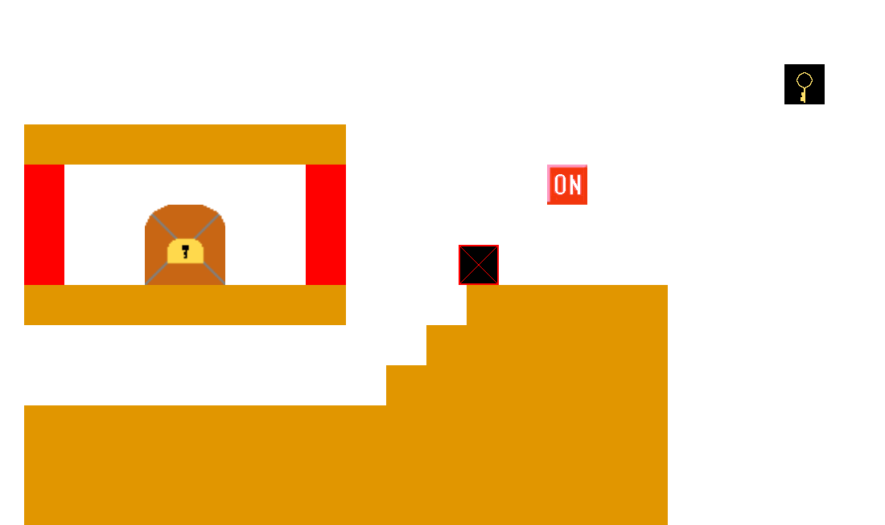

# PATIMON PARK

## 実行環境の必要条件
* python >= 3.10
* pygame >= 2.1

## ゲームの概要
シングルプレイのアクションパズルゲーム。

## ゲームの遊び方
* ゲームプレイはpyフォルダ内の「main.py」から
* A,D,SPACEキーで操作、Fキーで操作キャラ入れ替えができます
* ステージのどこかにある鍵を入手し、ゴールに到達するとクリアとなります
* 奈落に落ちたり、トゲに当たるとゲームオーバーです

### 共通基本機能
* 床と壁の衝突判定
* 重力
* Playerの描画
* マップの描画
* 横スクロール

### 分担追加機能
* プレイヤー切り替え、ゲームオーバー、扇風機（担当：YakumoKazama）
* ギミック用のボタン（担当：C0A242842a）
* 棘、バネ（担当：c0a2418041）
* ゴール、鍵（担当：c0a241202a）
* 砲台（担当：c0a242085d）

### ToDo
- 今の操作キャラ、次の操作キャラが分かりやすいようにする
- 天井についた棘は, プレイヤーが真下に来たら落ちるようにする
- 全員がゴールに着いたらゲームクリアにする

### メモ
* 新しくクラスを定義する際は必ず「クラス名.py」を作り, その中に記述する
* 新しい定数は「const.py」に追記してください
* 新しい画像は「fig/」下に追加してください. また, 画像は極力[ミニドット絵メーカー３](https://neutralx0.net/tools/dot3/)で作成し, 画像サイズは25×25または50×50にしてください

### マップ読み込みのID対応表
|ID|内容|
|----|----|
|1|通常ブロック|
|2|可視ブロック（ON）|
|3|可視ブロック（OFF）|
|4|スイッチ（ON）|
|5|スイッチ（OFF）|
|6|棘|
|7|ばね|
|a|プレイヤー（赤）|
|b|プレイヤー（橙）|
|c|プレイヤー（緑）|
|d|プレイヤー（青）|
|e|プレイヤー（紫）|
|w|扇風機（右）|
|x|扇風機（上）|
|y|扇風機（左）|
|z|扇風機（下）|
|A|砲台（右）※未実装|
|B|砲台（右下）※未実装|
|C|砲台（下）※未実装|
|D|砲台（左下）※未実装|
|E|砲台（左）※未実装|
|F|砲台（左上）|
|G|砲台（上）※未実装|
|H|砲台（右上）|
|K|鍵|
|G|ゴール|
